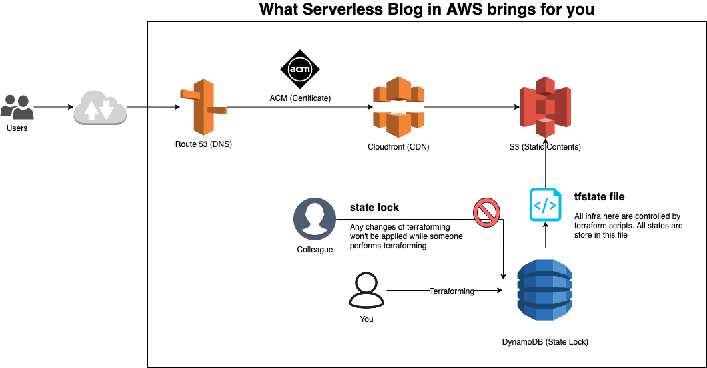

# Serverless Blog in AWS

Serverless Blog is a highly scalable and fast blog by hosting static contents with serverless technologies.

## Getting Started

These instructions will get you a copy of the project up and running on your AWS environment. See deployment for notes on how to deploy the project on a live system.

### Prerequisites

Before you start building your serverless blog, you need:

- To use terraform *v0.12.x*
- To have an IAM role for perfoming `$ terraform init`. In this case, the "role/Administrator" below is used as an example IAM role.

```
[IAM Role Name]
Administrator

[IAM Policy]
AdministratorAccess (AWS Managed)

[Trust Relationship]
{
  "Version": "2012-10-17",
  "Statement": [
    {
      "Sid": "OpsInit",
      "Effect": "Allow",
      "Principal": {
        "AWS": "arn:aws:iam::<your-aws-accountid>:root"
      },
      "Action": "sts:AssumeRole"
    }
  ]
}
```

- To have your DNS domain.

### Overview

Here is AWS architecture overview of this project.



## Deployment

### Initialize Resources for Terraform
1. Go to the `tf-init` folder
2. Follow the intructions under the README.md

### Setup Serverless Blog Architecture
1. Go to the `tf-static-website` folder
2. Follow the intructions under the README.md

## Built With

* [Terraform](https://www.terraform.io/) - Used for deployment

## Authors

* **Amesousan** [Twitter](https://twitter.com/amezousan)

## License

This project is licensed under the Apache 2.0 License.