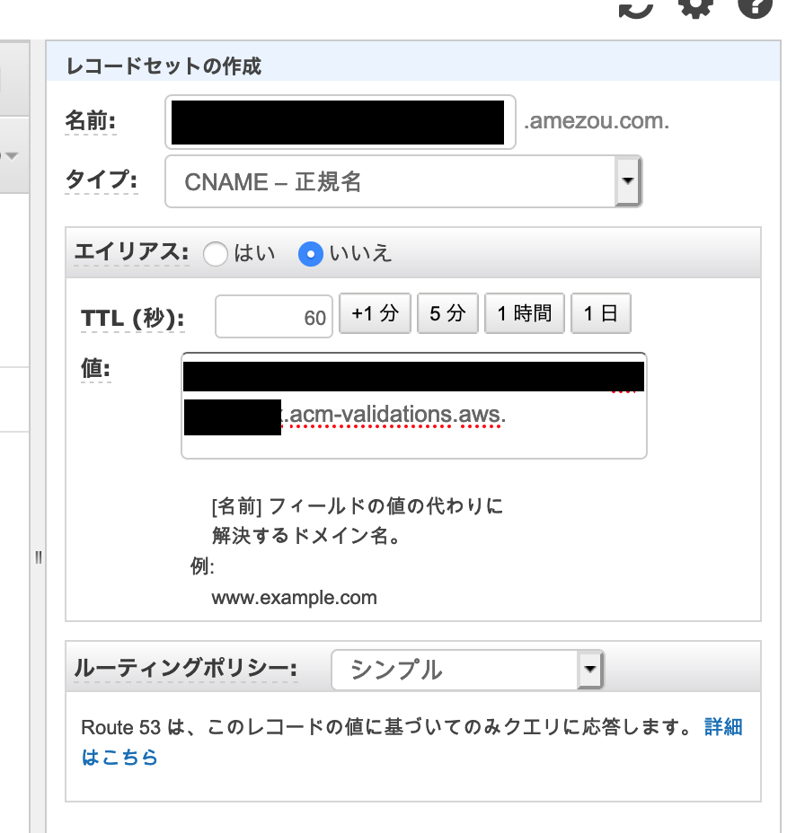

# Setup Serverless Blog Architecture

These terraform scripts will set up a new serverless blog architecture. There are several manual steps below. In this case, *terraform-init-user* is used as an example of an IAM user.

## Getting Started

### Rename & Modify the tfbackend file
1. Rename `backend-config/s3-template.tfbackend` to `backend-config/s3.tfbackend`
2. Change values in the file to appropriate values that you have.

### Apply the terraform scripts
1. Run `$ AWS_PROFILE=terraform-init-user terraform init -backend-config=backend-config/s3.tfbackend`
2. Run `$ AWS_PROFILE=terraform-init-user terraform apply`
3. You will always get an error below, but that's expected because your certificate is not valid yet.
```
Error: error creating CloudFront Distribution: InvalidViewerCertificate: The specified SSL certificate doesn't exist, isn't in us-east-1 region, isn't valid, or doesn't include a valid certificate chain.
	status code: 400, request id: a0a4c599-5a1d-41b4-869a-0c508ad3e06d
```

### Validate certificate
1. Go to the [ACM Console](https://console.aws.amazon.com/acm/home?region=us-east-1#/) in us-east-1.
2. Download the dns config.
3. Add the config to your Route53.



4. Wait until the cert is valid.

### Complete Cloudfront setup
1. Run `$ AWS_PROFILE=terraform-init-user terraform apply`
2. Add the cloudfront's domain name to Route53 as A record + Alias.


### How to access your blog?
1. Upload a `index.html` file into your S3 bucket.
2. Your contents won't be applied immediately and you need to wait for a while due to caching of cloudfront.